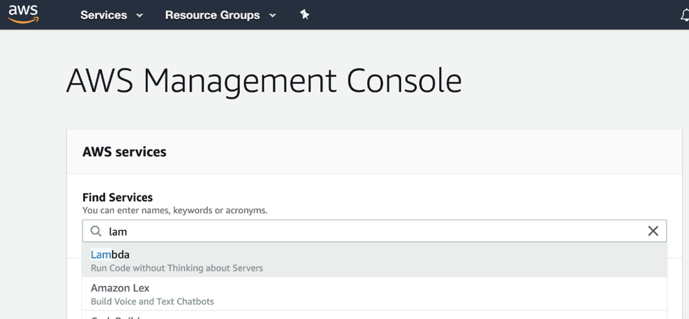
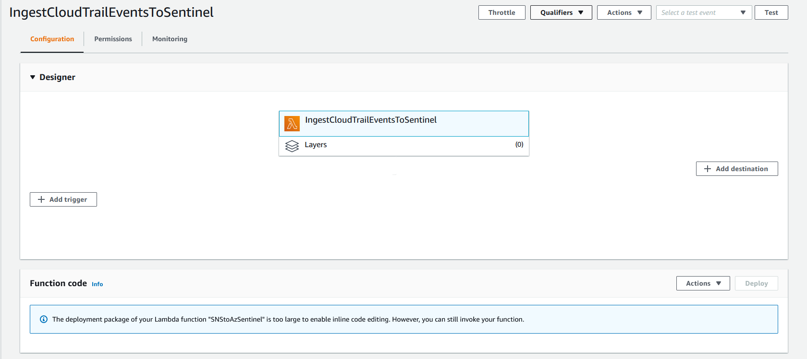
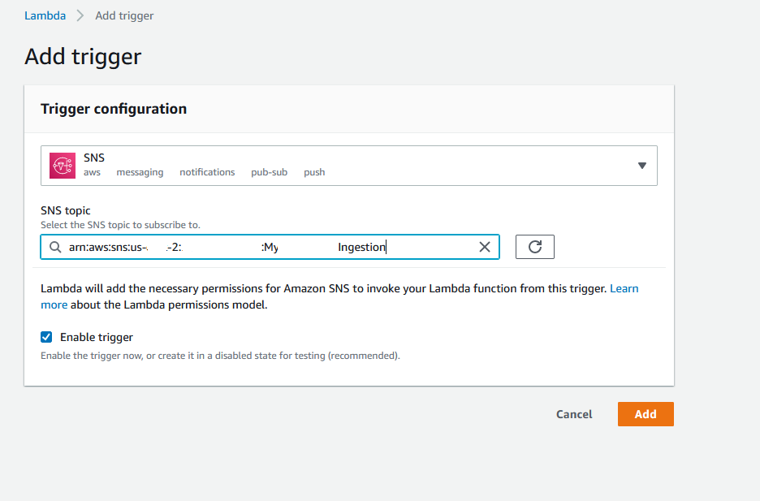

# AWS Lambda Function to import S3 Files to Azure Sentinel
This Lambda function is desgined to read SNS Files and send them to Azure Sentinel using the Log Analytics API.

Flow:
CloudTrail Logs --> AWS S3 --> AWS SNS Topic --> AWS Lambda --> Azure Log Analytics


## Deployment
### Machine Setup
To deploy this, you will need a machine prepared with the following:
 - PowerShell Core – I recommend PowerShell 7 [found here](https://github.com/PowerShell/PowerShell/releases)
 - .Net Core 3.1 SDK [found here](https://dotnet.microsoft.com/download) 
 - AWSLambdaPSCore module – You can install this either from the [PowerShell Gallery](https://www.powershellgallery.com/packages?q=AWSLambdaPSCore), or you can install it by using the following PowerShell Core shell command:  
```powershell
Install-Module AWSLambdaPSCore -Scope CurrentUser
```
See the documentation here https://docs.aws.amazon.com/lambda/latest/dg/powershell-devenv.html 

I recommend you review https://docs.aws.amazon.com/lambda/latest/dg/powershell-package.html to review the cmdlets that are part of AWSLambdaPSCore.

Note: If the environment uses a proxy, you may need to add the following to VSCode profile
```powershell
Added to VS Code profile:
$webclient=New-Object System.Net.WebClient
$webclient.Proxy.Credentials = [System.Net.CredentialCache]::DefaultNetworkCredentials
```
### Create AWS Role
The Lambda function will need an execution role defined that grants access to the S3 bucket and CloudWatch logs.  To create an execution role: 
1. Open the [roles](https://console.aws.amazon.com/iam/home#/roles) page in the IAM console. 
2. Choose Create role. 
3. Create a role with the following properties. 
 - Trusted entity – AWS Lambda. 
 - Permissions – AWSLambdaBasicExecutionRole &  AmazonS3ReadOnlyAccess . 
 - Role name – AWSSNStoAzureSentinel. 

The AWSLambdaExecute policy has the permissions that the function needs to manage objects in Amazon S3 and write logs to CloudWatch Logs.  Copy the arn of the role created as you will need it for the next step. 

### Create the Lambda Function
To deploy the PowerShell script, you can create a Package (zip file) to upload to the AWS console or you can use the Publish-AWSPowerShell cmdlet.
```powershell
Publish-AWSPowerShellLambda -Name YourLambdaNameHere -ScriptPath <path>/SNStoAzSentinel.ps1 -Region <region> -IAMRoleArn <arn of role created earlier> -ProfileName <profile>
```
You might need –ProfileName if your configuration of .aws/credentials file doesn't contain a default.  See this document for information on setting up your AWS credentials. 

### Edit the Lambda Trigger
1. Once created, login to the AWS console.   In Find services, search for Lambda.  Click on Lambda.

2. Click on the lambda function name you used with the cmdlet.  Click Environment Variable

2. Click on the lambda function name you used with the cmdlet. Click Add Trigger 

3. Select SNS.  Select the bucket.  Acknowledge the warning at the bottom.  Click Add. 

4. Your lambda function is ready to send data to Log Analytics.   

### Test the function
1. To test your function, Perform some actions like Start EC2, Stop EC2, Login into EC2, etc.,. 
2. To see the logs, go the Lambda function.  Click Monitoring tab.  Click view logs in CloudWatch. 

3. In CloudWatch, you will see each log stream from the runs.  Select the latest.   

4. Here you can see anything from the script from the Write-Host cmdlet. 

5. Go to portal.azure.com and verify your data is in the custom log. 


  
